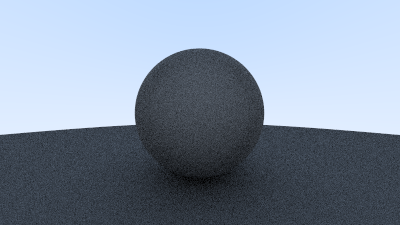

# raytracing

--- 

## Images generated by this raytracer:

- Diffuse Sphere with Lambertian Reflectance for Shadows:
  - 

- Diffuse Sphere again, with Darker Colors:
  - 

- Sphere with Antialiasing and Colored Normal Vectors:
  - 

--- 

## Description

- Personal project implementing the explanation of raytracing at https://raytracing.github.io/books/RayTracingInOneWeekend.html,
with personal comments and changes to the raytracer for understanding and improvement.

--- 

## Author:

- Christopher Li
  - [Christopher Li's Github Profile](https://github.com/cli135)

--- 
