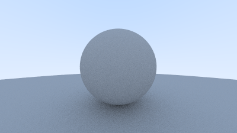
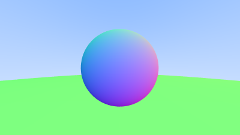

# raytracing

Personal project implementing the explanation of raytracing at https://raytracing.github.io/books/RayTracingInOneWeekend.html,
with personal comments and changes to the raytracer for understanding and improvement.

Diffuse Sphere with Lambertian Reflectance for Shadows:

Sphere with Antialiasing and Colored Normal Vectors:

Author:
Christopher Li
